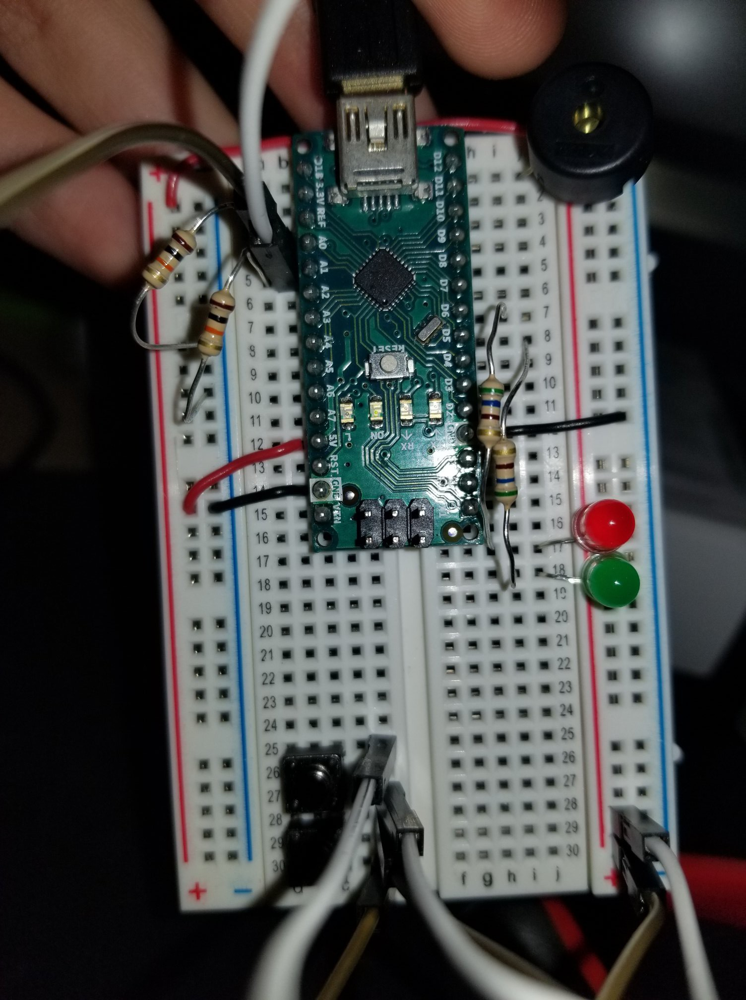

# Arduino LED Reaction Game
This is a small game I made using an Arduino Nano for the class Physical Computing (IGME 470)

### Circuit Diagram

### My setup

### How to Play
* The point of the game is to press the button corresponding to the light that is currently lit. 
* On my setup, the bottom button corresponds to the green LED, while the top button corresponds to the red LED.
* The two LEDs will light up for a random amount of time, independent from one another.
* Pressing the correct button while the LED is lit up will add 1 point to an internal counter.
* Pressing a button while the corresponding LED is not lit up, will subtract 1 point.
* There is a buzzer attached that will make sounds depending on success/failure.
* By default, the win condition is to get 20 points.
* Upon reaching the 20th point, a small jingle will play, signifying you won the game and then restarting.
* If desired, a custom win condition can be set by holding both buttons down while the Arduino is powering on.
* Both LEDs will turn on, telling you that you're now in win condition selection mode.
* Pressing the button that corresponds to the green LED will increment the score by 1, starting at 1.
* When the desired win condition is reached, pressing the button corresponding to the red LED will start the game.
* In addition, information such as the current score, winning score, and winning score selection is printed to the Serial monitor for ease of use.
